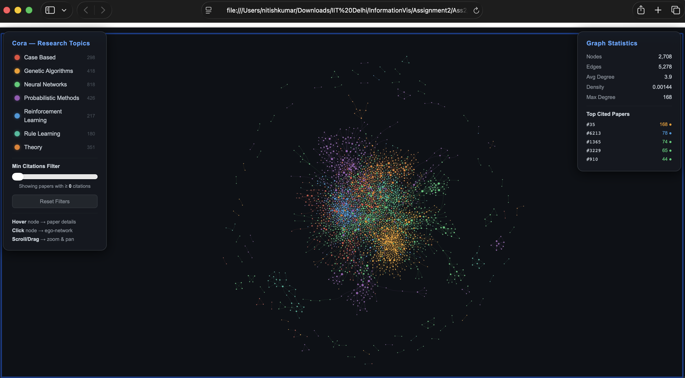
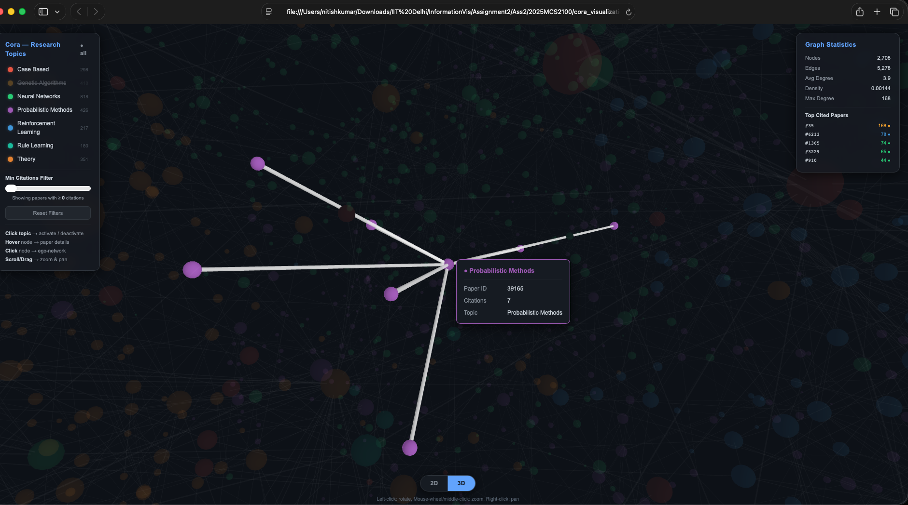
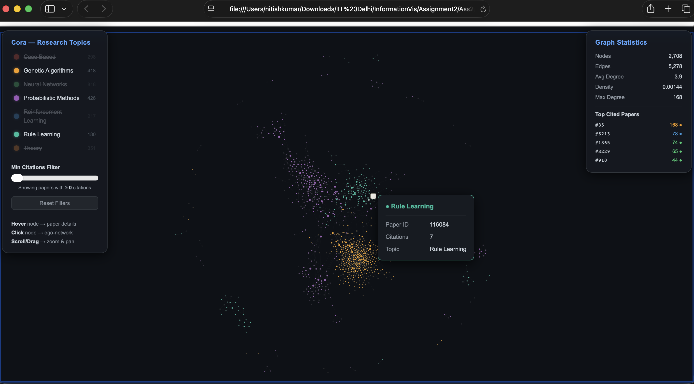
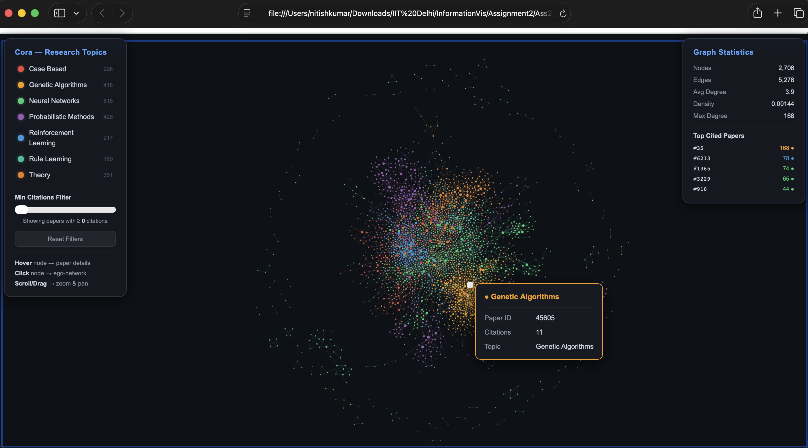
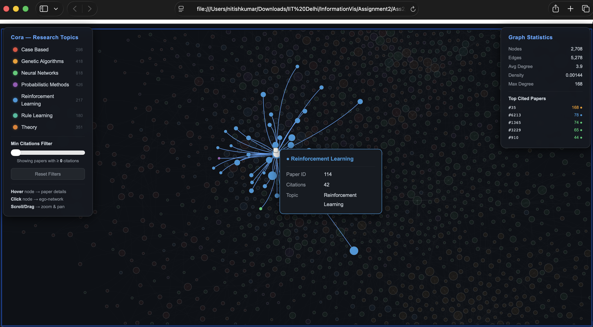

# Cora Citation Network Visualization
**IIT Delhi – Information Visualization**
**Developed by:** Nitish Kumar (2025MCS2100)

---

## 🚀 What This Is

I built an interactive, cinematic 3D and 2D visualization of the Cora Citation Network. The network consists of 2,708 research papers as nodes and 5,278 citation links as edges. The nodes are colored by their research topic and sized based on how many citations they have.

I added a few cool features to make exploring the graph a lot more engaging:
- **Cinematic Dark Theme**: It includes floating neon orbs on load and glassmorphism-styled statistic panels.
- **2D / 3D Toggle**: You can switch seamlessly between a 2D physics layout (using PyVis) and an immersive 3D force-directed graph (using 3d-force-graph).
- **Interactive Filtering**: Filter nodes instantly by toggling specific research topics or adjusting the minimum-citation slider.
- **Ego-Network Highlight**: Click on any paper to dim the rest of the graph and highlight only its direct neighboring citations.
- **Live Graph Statistics**: A real-time HUD showing average degree, density, max degree, and top-cited papers.

---

## 📚 Dataset Reference

The dataset I used is the well-known Cora dataset, which contains machine learning papers classified into one of seven classes (Case_Based, Genetic_Algorithms, Neural_Networks, Probabilistic_Methods, Reinforcement_Learning, Rule_Learning, Theory). The network includes 2,708 papers and 5,429 citation links. (Note: after standard data cleaning to remove self-loops and isolated nodes, it reduces to 5,278 edges).

*Reference:*
Sen, P., Namata, G., Bilgic, M., Getoor, L., Galligher, B., & Eliassi-Rad, T. (2008). Collective classification in network data. *AI magazine*, 29(3), 93-93.

The raw dataset was provided by the [LINQS Statistical Relational Learning Group](https://linqs.org/datasets/#cora).

---

## 🛠️ Requirements

- Python 3.9 or later
- Internet connection (needed on the first run to download the dataset, and for loading the 3D graph via CDN when switching to 3D mode)

---

## 💻 How to Run

### macOS

```bash
pip install networkx pyvis
python visualize_cora.py
open cora_visualization.html
```

### Windows

```bash
pip install networkx pyvis
python visualize_cora.py
start cora_visualization.html
```

### Linux

```bash
python3 -m venv env
source env/bin/activate
pip install networkx pyvis
python visualize_cora.py
xdg-open cora_visualization.html
```

Or just double-click `cora_visualization.html` in your file explorer.

---

## ⚙️ What Happens on First Run

1. The script downloads the Cora dataset (~2 MB) from the LINQS server into the `cora_data/` directory.
2. It builds the graph and applies the force-directed layout.
3. It generates and saves `cora_visualization.html`. This file works offline after generation (except for the 3D CDN which requires internet).

Subsequent runs will simply skip the download and use the cached data.

---

## 📸 Screenshots

### Full 2D Network View


### 3D Force-Directed View


### Interactive Filtering


### Node Hover Info


### Ego-Network Highlight (Click)

